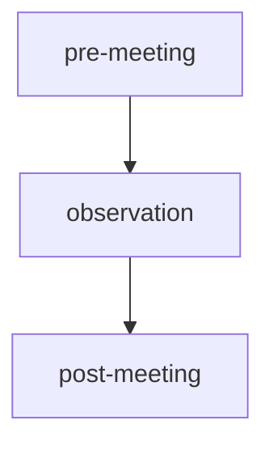
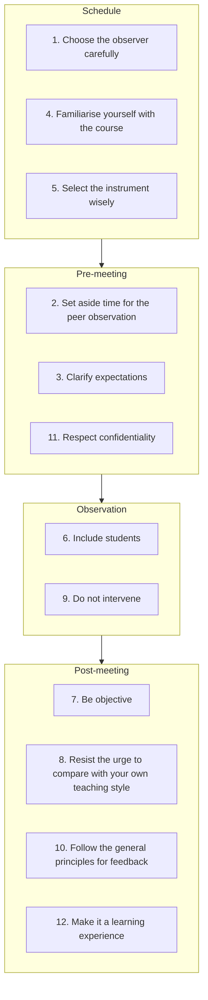

---
tags:
  - faq
  - frequently asked questions
  - answers
---

# FAQ

- About [this group](#this-group)
- About [peer observation](#peer_observation)

## This group

### What is the goal of this group?

The goal of this group is
to practice peer observation (of teaching)
to become a better teacher

## How do I know when I can possibly observe?

Opportunities to observe are announced in:

- The SciLifeLab `#peer-observation-of-teaching` channel
- The email list

## I am not part of SciLifeLab. Am I welcome to join?

Yes.

## How can I contact this group?

See [contact us](contact_us.md).

## How can I follow this group?

See [follow us](follow_us.md).

## Peer observation

### What is peer observation?

Peer observation (of teaching) is the observation of a teaching session,
after which this session is used as a shared experience to be discussed
as equals.

This follows the 'Peer review model' from `[Gosling, 2002]`, below:

<!-- markdownlint-disable MD013 --><!-- Tables cannot be split up over lines, hence will break 80 characters per line -->

**Characteristic**                   | **Peer Review Model**
-------------------------------------|------------------------------------------------------------
Who does it and to whom?             | Teachers observe each other
Purpose                              | Analysis, discussion, wider experience of teaching methods
Outcome                              | Non-judgemental, constructive feedback
Relationship of observer to observed | Equality/mutuality
Confidentiality                      | Between observer and the observed
Judgement                            | Non-judgemental, constructive feedback
What is observed?                    | Teaching performance, class, learning materials
Who benefits?                        | Mutual between peers
Conditions for success               | Teaching is valued, discussed
Risks                                | Complacency, conservatism, unfocused

<!-- markdownlint-enable MD013 -->

### How does a peer observation work?

For the peer observation of one teaching session,
there are three contact moments:

To make a peer observation a pleasant experience,
these are some recommendations, from `[Siddiqui et al., 2007]`:

Tip | Title, from `[Siddiqui et al., 2007]`
----|-------------------------------------------------------------------
1   | Choose the observer carefully
2   | Set aside time for the peer observation
3   | Clarify expectations
4   | Familiarise yourself with the course
5   | Select the instrument wisely
6   | Include students
7   | Be objective
8   | Resist the urge to compare with your own teaching style
9   | Do not intervene
10  | Follow the general principles for feedback
11  | Respect confidentiality
12  | Make it a learning experience

Here are the phases combined with the recommendations from
`[Siddiqui et al., 2007]` combined:

### Why is peer observation important?

- Peer observation of teaching is
  **one of the two most important ways**
  to grow as a teacher `[Lowyck and Verloop, 1995]`.
- Peer observation of teaching is **thé** tool of choice
  to support the educational development of university teachers
  `[Bélisle and Fernandez, 2024]`
- in professional teacher development in universities,
  peer observation of teaching is **one of the few things**
  valued among university teachers `[Smith and Wyness, 2025]`

### How important are peer observations compared to other activities?

- It is among the **two** most important ways to grow as a teaching
  (the other being self-reflection)
  `[Lowyck and Verloop, 1995]`.
- It is the **one** tool of choice to support
  the educational development of university teachers
  `[Bélisle and Fernandez, 2024]`
- It is **one of the few things**
  valued among university teachers
  as a professional teacher development activity
  `[Smith and Wyness, 2025]`
- On their own, workshops are not enough
  to actually grow as a teacher `[Steinert et al., 2016]`
- There is no evidence that feedback from learners
  improves teaching `[Kember et al., 2002]`

## References

- `[Bélisle and Fernandez, 2024]`
  Bélisle, Marilou, Valérie Jean, and Nicolas Fernandez.
  "The educational development of university teachers:
  mapping the landscape." Frontiers in Education.
  Vol. 9. Frontiers Media SA, 2024.
- `[Kember et al., 2002]`
  Kember, David, Doris YP Leung, and KyP Kwan.
  "Does the use of student feedback questionnaires improve
  the overall quality of teaching?."
  Assessment & Evaluation in Higher Education 27.5 (2002): 411-425.
- `[Lowyck and Verloop, 1995]`
  Lowyck, Joost, and Nico Verloop. Onderwijskunde:
  een kennisbasis voor professionals. Wolters-Noordhoff, 1995.
- `[Siddiqui et al., 2007]`
  Siddiqui, Zarrin Seema, Diana Jonas-Dwyer, and Sandra E. Carr.
  "Twelve tips for peer observation of teaching."
  Medical teacher 29.4 (2007): 297-300.
- `[Smith and Wyness, 2025]`
  Smith, Bethany, and Lynne Wyness.
  "What makes professional teacher development in universities effective?
  Lessons from an international systematised review."
  Professional Development in Education 51.7 (2025): 1550-1572.
  [DOI](https://doi.org/10.1080/19415257.2024.2386666)
- `[Steinert et al., 2016]`
  Steinert, Yvonne, et al. "A systematic review of faculty development
  initiatives designed to enhance teaching effectiveness:
  A 10-year update: BEME Guide No. 40." Medical teacher 38.8 (2016): 769-786.
